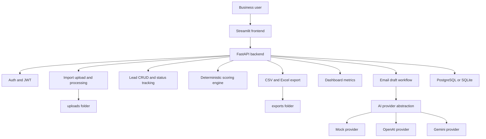

# LeadFlow AI

LeadFlow AI is a production-like portfolio project for lead management, follow-up prioritization,
and AI-assisted email draft preparation.

It is built as a pragmatic internal business tool for small sales teams, B2B service agencies,
recruitment agencies, estate agents, marketing teams, and freelancers who still manage inbound or
outbound leads in spreadsheets.

The project does not send emails. It helps a user clean lead data, prioritize follow-up, generate editable drafts, approve them, and export ready-to-send files.

## Business Problem

Small teams often collect leads from several places:

- Website forms
- LinkedIn outreach
- Referrals
- Events
- Cold lists
- Manual spreadsheets

The data usually arrives messy. Some rows are missing email addresses or phone numbers. Company
names are inconsistent. High-value leads can sit in a spreadsheet for days because nobody has a
clear priority order.

The manual workflow is slow:

1. Open a spreadsheet.
2. Check which leads have usable contact details.
3. Guess which leads deserve attention first.
4. Write follow-up emails from scratch.
5. Copy drafts into another tool.
6. Repeat the same process next week.

LeadFlow AI turns that into a structured workflow.

## Solution

LeadFlow AI allows a user to:

1. Upload a CSV or Excel lead file.
2. Validate the file and inspect import metadata.
3. Process rows into lead records.
4. Detect missing contact data and required fields.
5. Calculate a deterministic Follow-up Priority Score.
6. Categorize leads as Hot, Warm, Nurture, or Low Priority.
7. Track lead status through the pipeline.
8. Generate personalized follow-up email drafts through an AI provider abstraction.
9. Edit, approve, rewrite, archive, or export drafts.
10. Download approved drafts as CSV or Excel.

AI is used only for draft generation and rewriting. The scoring rules are deterministic and explainable.

## Key Features

- User registration, login, JWT authentication, and current user endpoint.
- CSV, XLSX, and XLS lead import upload.
- File type and upload size validation.
- Import preview with row count, column count, columns, and dtype information.
- Data loading, normalization, cleaning, and duplicate detection with pandas.
- Import processing workflow that creates Lead records without failing the whole import on incomplete rows.
- Missing email, phone, and company detection.
- Follow-up Priority Score with transparent scoring breakdown.
- Lead filtering, pagination, sorting, CRUD, and status tracking.
- Lead activity records for important workflow actions.
- Dashboard summary and chart-ready JSON.
- AI provider abstraction for mock, OpenAI, and Gemini providers.
- Email draft generation, bulk draft generation, approval, rewrite, archive, and delete workflows.
- CSV and Excel export for ready-to-send approved drafts.
- Docker Compose setup with backend, frontend, PostgreSQL, and optional pgAdmin.
- Backend test suite covering core business behavior.

## Architecture



## Tech Stack

Backend:

- FastAPI
- SQLAlchemy 2.x
- Alembic
- Pydantic v2
- pandas
- PyJWT
- bcrypt
- PostgreSQL through Docker
- SQLite fallback for local development
- pytest, pytest-cov, Ruff, mypy

Frontend:

- Streamlit
- requests
- Plotly

Infrastructure:

- Docker
- Docker Compose
- PostgreSQL
- Optional pgAdmin

## Folder Structure

```text
leadflow-ai/
├── backend/
│   ├── alembic/
│   ├── app/
│   │   ├── api/
│   │   ├── core/
│   │   ├── db/
│   │   ├── models/
│   │   ├── repositories/
│   │   ├── schemas/
│   │   └── services/
│   ├── scripts/
│   ├── tests/
│   ├── Dockerfile
│   ├── README.md
│   └── pyproject.toml
├── frontend/
│   ├── app/
│   │   ├── components/
│   │   ├── pages/
│   │   ├── services/
│   │   └── utils/
│   ├── scripts/
│   ├── Dockerfile
│   ├── README.md
│   └── requirements.txt
├── sample_data/
├── docs/
│   ├── screenshots/
│   ├── business_case_study.md
│   └── deployment.md
├── uploads/
├── exports/
├── docker-compose.yml
├── .env.example
├── Makefile
└── README.md
```

## API Overview

Main API prefix:

```text
/api/v1
```

Core endpoint groups:

- `GET /api/v1/health`
- `POST /api/v1/auth/register`
- `POST /api/v1/auth/login`
- `GET /api/v1/auth/me`
- `POST /api/v1/imports/upload`
- `GET /api/v1/imports`
- `GET /api/v1/imports/{import_id}`
- `DELETE /api/v1/imports/{import_id}`
- `POST /api/v1/imports/{import_id}/process`
- `POST /api/v1/imports/{import_id}/score`
- `GET /api/v1/leads`
- `POST /api/v1/leads`
- `GET /api/v1/leads/{lead_id}`
- `PATCH /api/v1/leads/{lead_id}`
- `DELETE /api/v1/leads/{lead_id}`
- `PATCH /api/v1/leads/{lead_id}/status`
- `POST /api/v1/leads/{lead_id}/score`
- `GET /api/v1/leads/{lead_id}/score`
- `POST /api/v1/leads/score-all`
- `GET /api/v1/dashboard/summary`
- `GET /api/v1/dashboard/charts`
- `POST /api/v1/leads/{lead_id}/email-draft`
- `POST /api/v1/email-drafts/bulk`
- `GET /api/v1/email-drafts`
- `PATCH /api/v1/email-drafts/{draft_id}`
- `PATCH /api/v1/email-drafts/{draft_id}/approve`
- `POST /api/v1/email-drafts/{draft_id}/rewrite`
- `POST /api/v1/exports/email-drafts/csv`
- `POST /api/v1/exports/email-drafts/excel`
- `GET /api/v1/exports`
- `GET /api/v1/exports/{export_id}/download`

Interactive API docs are available at:

```text
http://localhost:8000/docs
```

## Screenshot Placeholders

Screenshot placeholders are documented in [docs/screenshots/README.md](docs/screenshots/README.md).

Planned screenshots:

- Login and registration
- Dashboard metrics
- Lead upload
- Imports page
- Leads workspace
- Lead detail
- Email draft review
- Export center

## Sample Data

The `sample_data` folder contains fictional datasets for testing the product workflow:

- `b2b_service_leads.csv`
- `real_estate_leads.csv`
- `recruitment_leads.xlsx`

The datasets intentionally include missing emails, missing phone numbers, missing company names,
different lead sources, different urgency and timeline values, and duplicate-looking records. This
makes the import validation and scoring workflow more realistic than a perfectly clean demo file.

The sample data is fictional and should not be treated as real business contact data.

## Run Locally

Create an environment file:

```bash
cp .env.example .env
```

Install backend dependencies from the project root:

```bash
python3.12 -m venv .venv
source .venv/bin/activate
python -m pip install --upgrade pip
pip install -e ./backend
```

Run migrations:

```bash
cd backend
alembic upgrade head
cd ..
```

Run the backend:

```bash
make backend
```

Install frontend dependencies:

```bash
pip install -r frontend/requirements.txt
```

Run the frontend:

```bash
make frontend
```

Open:

- Backend: `http://localhost:8000`
- API docs: `http://localhost:8000/docs`
- Frontend: `http://localhost:8501`

SQLite fallback:

```env
DATABASE_URL=sqlite:///./leadflow.db
```

This is useful for quick local backend development without PostgreSQL.

## Run With Docker

Create an environment file:

```bash
cp .env.example .env
```

Start the stack:

```bash
docker compose up --build
```

Open:

- Backend: `http://localhost:8000`
- Frontend: `http://localhost:8501`
- PostgreSQL: `localhost:5432`

Start pgAdmin:

```bash
docker compose --profile tools up pgadmin
```

Stop the stack:

```bash
docker compose down
```

Remove database volumes:

```bash
docker compose down -v
```

## Run Tests

Run the backend test suite:

```bash
make test
```

Run tests with coverage:

```bash
make test-cov
```

Run linting:

```bash
make lint
```

Run type checks:

```bash
make type-check
```

Run the main quality check:

```bash
make quality
```

## AI Provider Setup

The default provider is `mock`.

```env
AI_PROVIDER=mock
```

This is the recommended setting for local development and tests.

To use OpenAI:

```env
AI_PROVIDER=openai
OPENAI_API_KEY=your-openai-api-key
```

To use Gemini:

```env
AI_PROVIDER=gemini
GEMINI_API_KEY=your-gemini-api-key
```

The AI provider only generates and rewrites email drafts. It does not score leads and it does not send emails.

## Export Examples

Approved email drafts can be exported as CSV or Excel.

Export columns include:

- `lead_id`
- `first_name`
- `last_name`
- `company_name`
- `email`
- `status`
- `category`
- `priority_score`
- `email_subject`
- `email_body`
- `draft_status`

Export rules:

- Approved drafts are exported by default.
- Draft-status emails can be included with an explicit option.
- Exported drafts are marked as `Exported`.
- Export metadata is stored in the database.
- Users can download only their own exports.

## Business Case Study

Read the business case study here:

[docs/business_case_study.md](docs/business_case_study.md)

## Design Trade-offs

- Streamlit keeps the frontend fast to build and easy to review, but it is not as flexible as a full React app.
- Scoring is rule-based instead of AI-based because sales priority should be explainable to the user.
- Import processing runs synchronously to keep the architecture readable. A queue would be better for large files.
- Email generation is provider-based, but sending is deliberately out of scope. Human approval stays in the workflow.
- SQLite is supported for quick local development, while PostgreSQL is the realistic target for Docker and deployment.

## Known Limitations

- The Streamlit frontend is intentionally simple and focused on internal workflows.
- The app does not send email. It exports ready-to-send drafts.
- The AI providers use a small abstraction, not a queue-based background job system.
- File imports are processed synchronously, which is fine for portfolio-scale files but not ideal for very large datasets.
- There is no role-based access control. Each user can access only their own data.
- The Docker Compose setup is for development, not a locked-down production deployment.
- OpenAI and Gemini calls depend on external provider availability and valid API keys.

## Future Improvements

- Background jobs for large imports, scoring, and draft generation.
- Better duplicate resolution UI.
- Team accounts and role-based permissions.
- Email provider integration for sending through Gmail, Outlook, or SMTP.
- Audit log page for lead and draft actions.
- More detailed import mapping UI for unusual spreadsheets.
- Stronger production deployment hardening.
- More frontend accessibility checks and visual regression tests.
